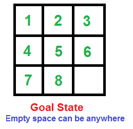

# 8-Puzzle Solver with UCS and A\* Search

## Overview

This project implements a solver for the classic 8-puzzle problem using:

- **Uniform Cost Search (UCS)**
- **A\* Search with Misplaced Tile Heuristic**
- **A\* Search with Manhattan Distance Heuristic**

The goal is to evaluate how different search strategies and heuristics perform on solving the 8-puzzle in terms of **solution cost**, **number of expanded nodes**, and **runtime**.



---

## Features

- Full implementation of UCS and A\* Search
- Two heuristics for A\*:
  - Misplaced Tile
  - Manhattan Distance
- Supports custom puzzle inputs
- Tracks and displays:
  - Number of expanded nodes
  - Solution depth
  - Maximum queue size
  - Execution time
- Clean CLI interface
- Modular code for easy experimentation

---

## Tools Used
- **Python 3.12** — Main programming language
- **NumPy** — Efficient numerical operations
- **Excel** — For data analysis and visualization
- **VSCode** — Development environment
- **GitHub** — Version control and project hosting

---
## Algorithms

### 1. Uniform Cost Search (UCS)
- Treats all moves equally (no heuristic).
- Explores paths in order of increasing cost.
- Often slower for deeper puzzles.

### 2. A\* Search with Misplaced Tile Heuristic
- Counts how many tiles are out of place.
- Fast, but less informed compared to Manhattan.

### 3. A\* Search with Manhattan Distance Heuristic
- Calculates total distance tiles are from their goal position.
- More accurate and often faster than the other two.

---

## Example Outputs

### Easy Puzzle
```
Initial State:
1 2 3
4 0 5
7 8 6

UCS:
- Goal depth: 4
- Nodes expanded: 6
- Max queue size: 6
- Time: 0.0012s

A* (Misplaced):
- Goal depth: 4
- Nodes expanded: 4
- Max queue size: 4
- Time: 0.0008s

A* (Manhattan):
- Goal depth: 4
- Nodes expanded: 3
- Max queue size: 3
- Time: 0.0006s
```

### Medium Puzzle
```
Initial State:
2 8 3
1 6 4
7 0 5

UCS:
- Goal depth: 14
- Nodes expanded: 338
- Max queue size: 125
- Time: 0.39s

A* (Misplaced):
- Goal depth: 14
- Nodes expanded: 106
- Max queue size: 40
- Time: 0.11s

A* (Manhattan):
- Goal depth: 14
- Nodes expanded: 67
- Max queue size: 24
- Time: 0.07s
```

### Hard Puzzle
```
Initial State:
5 6 7
4 0 8
3 2 1

UCS:
- Goal depth: 30
- Nodes expanded: 9943
- Max queue size: 1081
- Time: 6.1s

A* (Misplaced):
- Goal depth: 30
- Nodes expanded: 4754
- Max queue size: 408
- Time: 2.9s

A* (Manhattan):
- Goal depth: 30
- Nodes expanded: 2061
- Max queue size: 187
- Time: 1.2s
```

---

## Performance Summary

| Difficulty | Algorithm          | Nodes Expanded | Max Queue Size | Time (s) | Goal Depth |
|------------|--------------------|----------------|----------------|----------|-------------|
| Easy       | UCS                | 6              | 6              | 0.0012   | 4           |
|            | A\* (Misplaced)    | 4              | 4              | 0.0008   | 4           |
|            | A\* (Manhattan)    | 3              | 3              | 0.0006   | 4           |
| Medium     | UCS                | 338            | 125            | 0.39     | 14          |
|            | A\* (Misplaced)    | 106            | 40             | 0.11     | 14          |
|            | A\* (Manhattan)    | 67             | 24             | 0.07     | 14          |
| Hard       | UCS                | 9943           | 1081           | 6.1      | 30          |
|            | A\* (Misplaced)    | 4754           | 408            | 2.9      | 30          |
|            | A\* (Manhattan)    | 2061           | 187            | 1.2      | 30          |

---

## What I learned

- **Heuristics drastically improve efficiency** in solving the 8-puzzle compared to uninformed search.
- **Manhattan Distance is more effective** than Misplaced Tiles in reducing search space and runtime.
- **UCS becomes infeasible for deep puzzles**, while A\* remains practical.
- **Memory usage (queue size)** can grow quickly—especially with UCS.

---
